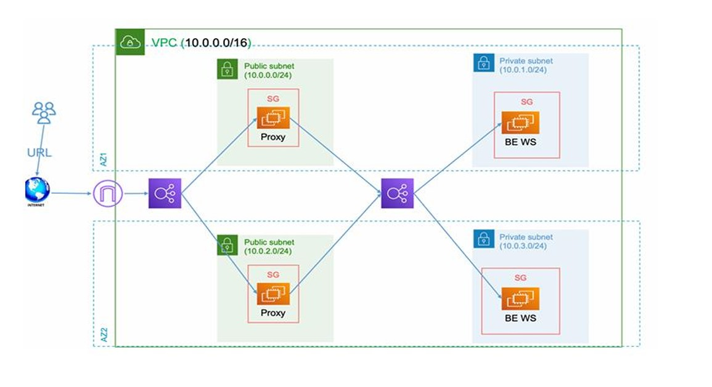

# 🌐 Terraform AWS Infrastructure - Modular Setup

This project sets up a **modular AWS infrastructure** using Terraform, including networking, security, compute resources, and load balancers. It supports a scalable architecture with reverse proxy servers in public subnets, backend servers in private subnets, NAT and Internet Gateways, internal/public Load Balancers, and remote backend state management via S3 and DynamoDB.

---
## 🖼 Architecture Diagram



---

## 📁 Project Structure

```
.
├── main.tf
├── variables.tf
├── outputs.tf
├── modules/
│   ├── VPC/
│   ├── SB/                   # Subnet module
│   ├── ec2-rev-proxy/
│   ├── ec2-backend/
│   └── LB/                   # Load Balancer module
```

---

## 🚀 Features

- **Remote Backend Configuration**
  - S3 bucket for state file storage
  - DynamoDB table for state locking

- **Networking**
  - VPC with custom CIDR
  - Public and private subnets (multi-AZ)
  - Internet Gateway, NAT Gateway
  - Route Tables with subnet associations

- **Security**
  - Central Security Group allowing HTTP and SSH

- **Compute**
  - EC2 module for Reverse Proxy in public subnets
  - EC2 module for Backend in private subnets

- **Load Balancing**
  - Internal Load Balancer for backend traffic
  - Public Load Balancer for reverse proxies

---

## 🧰 Prerequisites

- [Terraform](https://www.terraform.io/downloads)
- AWS CLI configured with appropriate credentials
- An existing AWS Key Pair
- Valid private key file on local system

---

## 🔧 Usage

1. **Clone the repository**
   ```bash
   git clone https://github.com/MostafaKassab41/AWS-Proxy-Backend-Terraform
   cd aws-terraform-infra
   ```

2. **Initialize the project**
   ```bash
   terraform init
   ```

3. **Customize variables**
   Edit `terraform.tfvars` or pass variables via CLI:
   ```bash
   terraform apply -var="key_pair=your-key" -var="private_key_path=/path/to/key.pem"
   ```

4. **Apply the configuration**
   ```bash
   terraform apply
   ```

---

## 🏗️ Modules Breakdown

| Module | Description |
|--------|-------------|
| `VPC` | Creates the main VPC |
| `SB` | Reusable subnet module |
| `ec2-rev-proxy` | Deploys EC2 instances in public subnets as reverse proxies |
| `ec2-backend` | Deploys EC2 instances in private subnets as backend servers |
| `LB` | Deploys Application Load Balancers (public or internal) |

---

## 🔐 Remote State Backend

- **S3 Bucket:** `my-terraform-state-backend-kassab`
- **DynamoDB Table:** `terraform-state-locks`

---

## 🛡 Security Group Rules

- Inbound:
  - Port `80` (HTTP) from anywhere
  - Port `22` (SSH) from anywhere
- Outbound:
  - All traffic allowed

---

## 📌 Notes

- This setup uses **modules** for clean separation and reusability.
- Make sure your EC2 AMIs and user data are defined inside the EC2 modules.
- Backend output IDs are passed to the load balancer module.


